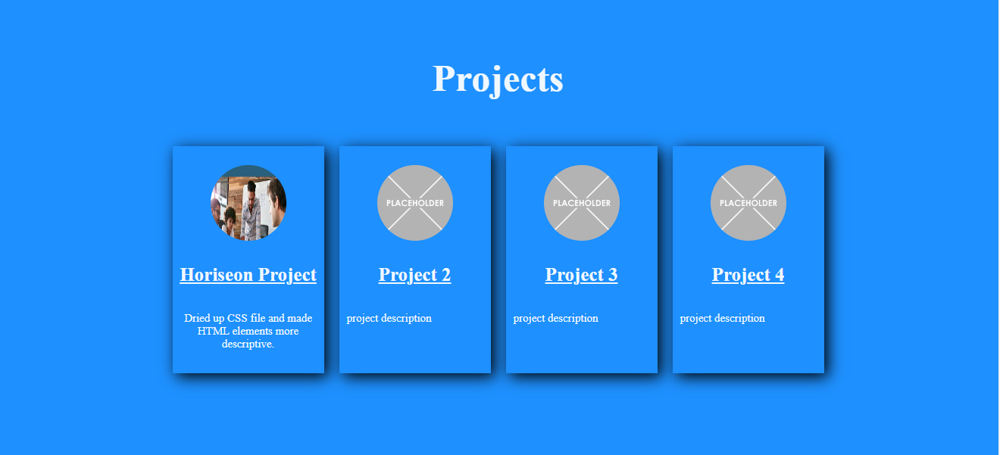

# Portfolio

## Description

- My motivation for this project was to begin designing my project portfolio.
- I built this project so that I have a chance to start collecting my works to begin a career in Back-End development.
-This solves the problem of employers asking for a portfolio and certification; this will eventually be hyperlinked to a resume.
- I learned that to get over a hump you must find a video that explains the issue rather well.

## Table of Contents (Optional)

- [About me](#about_me)
- [Portfolio](#portfolio)
- [Languages](#language)
- [Credits](#credits)
- [License](#license)

## About me

This section tells what I am looking for in future work as a back-end developer.

## Screenshot

    

## Credits

*followed this tutorial: https://www.youtube.com/watch?v=-D6oTPA4vXc

*used https://www.w3schools.com/howto/howto_css_hero_image.asp for help with inserting background image in hero section

## License

MIT License

---

🏆 